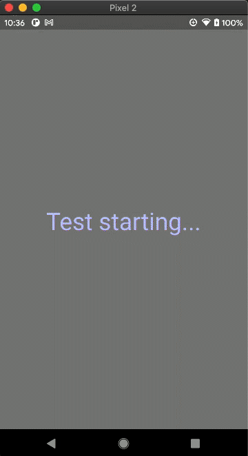
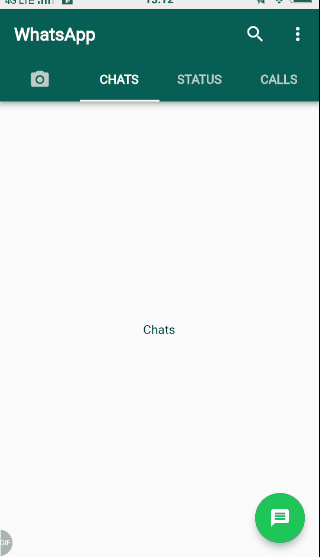
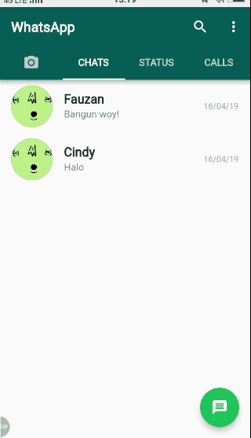
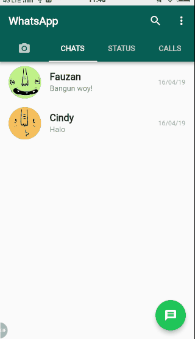
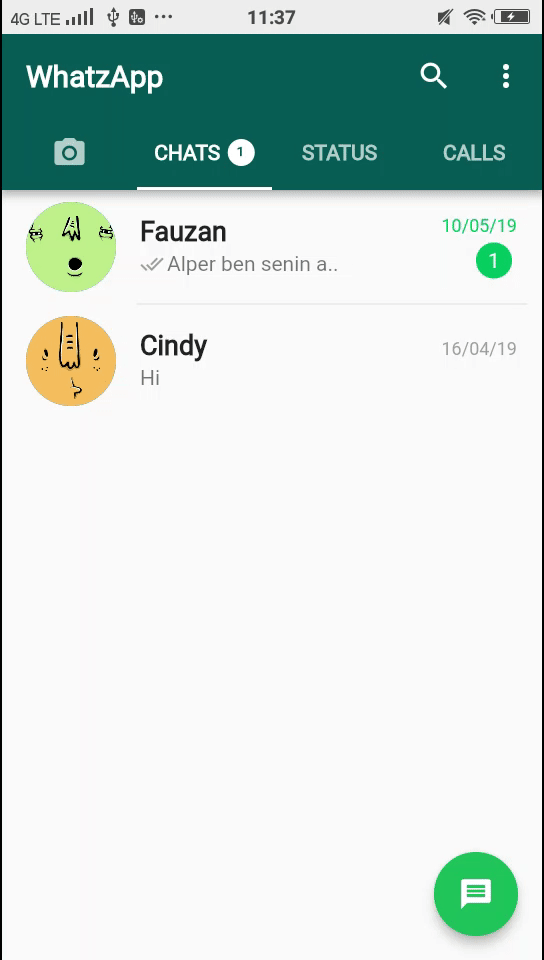

# flutter_whatsapp

[](https://gitter.im/flutter_whatsapp/community?utm_source=badge&utm_medium=badge&utm_campaign=pr-badge&utm_content=badge)

Whatsapp (ver. 2.19.98) clone using Flutter.

## About

I made this for my study/exercise on Flutter. I only make the client-side app, the server side is a dummy server.

## API Server Documentation

Refer to this [documentation](README_API.md).

## Development

To run this project on your own, do the following: 
1. Clone this project.
2. Run `flutter pub get`.
3. Create your own Firebase project and add the `google-services.json` to the folder `android/app` (for Android). This is a requirement for QR code reader package.
4. Run the project using `flutter run` or using your IDE's tools.

## Integration Testing

Integration testing utilizes `integration_test` library. Here's how to run the integration test:

- Windows:
  - Run the script `run_ui_tests.bat` in the terminal.
- Mac/Linux:
  - Run this command in the terminal:
    ```
    flutter drive --driver=test_driver/app.dart --target=integration_test/app_test.dart
    ```

Integration testing in action (Credit to [@karinamuraya](https://github.com/karinamuraya)):



## Screenshots

|     |     |
| :-: | :-: |
| AppBar & TabBar | List chats from API |
|  |  |
| Search through chats/statuses/calls  | Show popup when profile is clicked |
|  |  |
| Retrieve list of contacts in phone  | See chat messages and send a new message |
|  |  |
| See status detail | (Android) Retrieve images from DCIM folder and take a picture. |
|  |  |

* Others
  * Take a video and save it to DCIM/Camera folder.
  * Scan a QR code (Still buggy).
  * Make an intent to open Contacts app on Android.
  * Make an intent to open an email app to invite friends.
